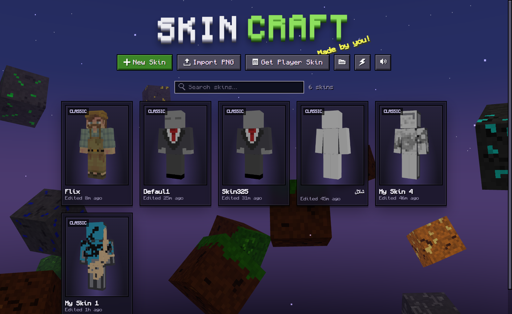
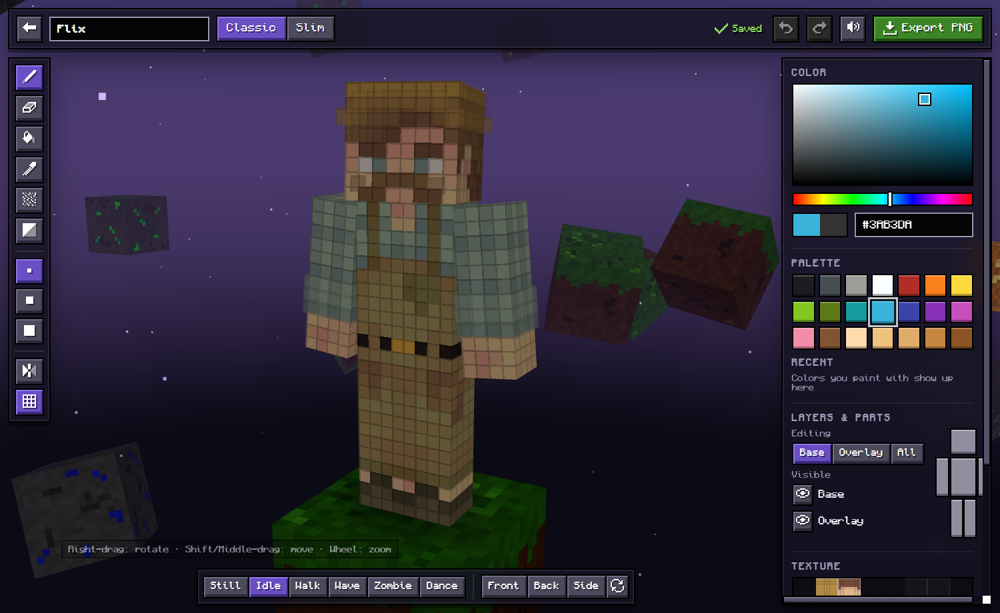
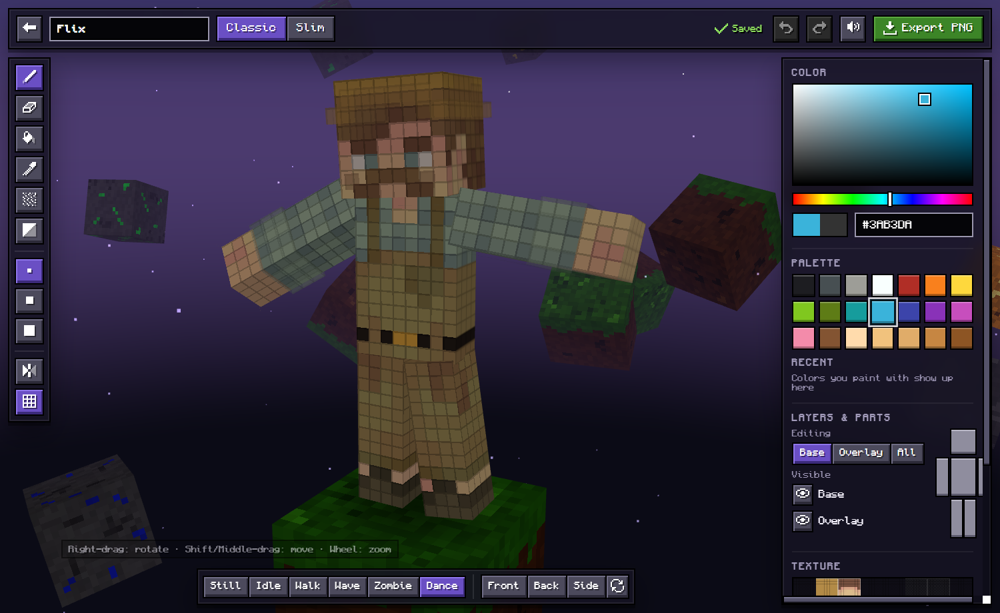

<div align="center">

# SkinCraft

**A free 3D Minecraft skin editor that runs in your browser.**
Paint right on the model, see every change live, and export a skin ready for Minecraft Java or Bedrock.
Works on PC, Mac, Linux, Chromebook, Android and iPhone, with an optional Windows app.

[](https://github.com/Steth22/SkinCraft/releases/latest)
[](https://github.com/Steth22/SkinCraft/releases)


### [▶ Open SkinCraft in your browser](https://steth22.github.io/SkinCraft/app/)

[⬇ Windows app](https://github.com/Steth22/SkinCraft/releases/latest) · [Website](https://steth22.github.io/SkinCraft/)



</div>

---

## Features

### Paint in 3D
- Paint **directly on the 3D model**, or on the flat 64×64 texture view beside it.
- Hover any pixel to see exactly where it lands (part, face and coordinates).
- **Mirror mode** paints the left and right sides at the same time.
- Classic (4px arms) and Slim (3px arms) models, switchable at any time.

### Tools
| Tool | What it does |
|------|--------------|
| **Pencil** | Paints pixels with brush sizes 1×1, 2×2 and 3×3 |
| **Eraser** | Makes pixels transparent |
| **Fill** | Four modes: **Area** (same-color pixels), **Face**, **Part** (a whole body part) and **All** (the whole layer), with a live preview before you click |
| **Color Picker** | Takes a color from the skin (Alt+Click works with any tool) |
| **Noise Brush** | Paints with random shading for a natural, textured look |
| **Shade** | Darkens pixels, or lightens them while holding Shift |

### Layers and parts
- Edit the **Base** layer, the **Overlay** (hat, jacket, sleeves), or **All**, which paints whichever pixel you see.
- Show or hide each layer, and click a body part on the mini figure to hide it and reach hidden spots.

### Library
- Every skin saves automatically. Pick any of them up again later.
- Create, rename, duplicate, export and delete skins (deleted skins go to the Recycle Bin).
- **Import PNG** skins, or just drag and drop them onto the window. Old 64×32 skins are converted automatically.
- **Get Player Skin** copies any Minecraft Java player's skin by username.
- New skins start as a clean gray template with dark edges.

### Made to feel alive
- Floating Minecraft blocks, pixel transitions, particles while you paint, and a landing animation.
- Pose previews: **Still, Idle, Walk, Wave, Zombie** and **Dance**.
- **Performance mode** (⚡ on the home screen) hides extra effects on slower PCs.

<div align="center">




</div>

---

## Get SkinCraft

### In your browser (no download)
Open **[steth22.github.io/SkinCraft/app](https://steth22.github.io/SkinCraft/app/)** in any modern browser: Chrome, Edge, Firefox, Safari or Brave, on PC, Mac, Linux, Chromebook, Android or iPhone.
- On phones and tablets: paint with one finger, use two fingers to zoom and rotate, and tap the color button for colors and layers.
- Use your browser's **Install** / **Add to Home Screen** option to keep it like an app. It also works offline.
- Your skins are saved in your browser on that device. Use **Export PNG** to keep a copy or move a skin to another device.

### Windows app
1. Open [**Releases**](https://github.com/Steth22/SkinCraft/releases/latest) and download `SkinCraft.exe`.
2. Run it. Nothing else to install: it's a single standalone file.

**Requirements:** Windows 10 or 11 (64-bit).
SkinCraft uses Microsoft Edge WebView2, which is built into Windows 11 and almost every Windows 10 PC. If it's missing, the app shows a link to the official download.

> **Windows SmartScreen:** the app isn't code-signed, so Windows may warn you the first time. Click **More info → Run anyway**.

---

## How to use

### Mouse
| Action | Control |
|--------|---------|
| Paint | Left click / drag on the model or the texture view |
| Rotate camera | Right-drag (or left-drag on empty space) |
| Move camera | Shift + drag, or middle-drag |
| Zoom | Mouse wheel (zooms toward the cursor) |

### Keyboard shortcuts
These work with any keyboard language.

| Key | Action |
|-----|--------|
| `B` / `E` / `G` / `I` / `N` / `S` | Pencil / Eraser / Fill / Color Picker / Noise / Shade |
| `1` `2` `3` | Brush size |
| `M` | Mirror mode |
| `X` | Switch layer (Base → Overlay → All) |
| `L` | Pixel grid |
| `F` / `R` | Front view / Reset camera |
| `Ctrl+Z` / `Ctrl+Y` | Undo / Redo |
| `Ctrl+S` / `Ctrl+E` | Save / Export PNG |
| `Ctrl+N` | New skin (home screen) |
| `Esc` | Back to the library |

### Use your skin in Minecraft
1. Click **Export PNG** in the editor.
2. **Java Edition:** go to [minecraft.net](https://www.minecraft.net) → Profile → Skin, upload the PNG and pick the same model (Classic or Slim).
3. **Bedrock Edition:** Dressing Room → Classic Skins → Import, then choose the PNG.

### Where are my skins?
**Web version:** saved in your browser on that device.

**Windows app:** each skin is a normal PNG named after the skin, in:

```
%APPDATA%\SkinCraft\skins
```

Click the 📁 button on the home screen to open it. Any 64×64 skin PNG you copy into this folder shows up in the library.

---

## FAQ

**Is SkinCraft free?**
Yes. No ads, no account, no payments.

**Does it work on Mac, Linux, Chromebook or my phone?**
Yes. [Open it in your browser](https://steth22.github.io/SkinCraft/app/). Touch controls are built in.

**Does it work for Bedrock and Java?**
Yes. It exports standard 64×64 PNG skins, which work in both editions.

**Can I edit a skin I already have?**
Yes. Import any PNG (old 64×32 skins are converted automatically) or copy a Java player's skin by username.

**Is there a PC version of the mobile 3D skin editor apps?**
That's what SkinCraft is: the same paint-on-the-3D-model workflow, on any device, with mouse, keyboard and touch controls.

**Windows says the app is unrecognized. Is it safe?**
The app isn't code-signed yet, so SmartScreen warns about new apps. Click **More info → Run anyway**. All the source code is here in this repository.

---

## Build from source

You need the [.NET 9 SDK](https://dotnet.microsoft.com/download/dotnet/9.0).

```bash
git clone https://github.com/Steth22/SkinCraft.git
cd SkinCraft
dotnet publish -c Release -o publish
```

The standalone app is written to `publish/SkinCraft.exe`.

The web app is the `wwwroot/` folder. Serve it with any static web server, for example `python -m http.server --directory wwwroot`. Run `python tools/sync_web.py` to copy it into `docs/app/`, which GitHub Pages serves at `/app/`.

### Project structure
```
SkinCraft/
├── MainForm.cs        # Window that hosts the WebView2 UI
├── Bridge.cs          # Messages between the UI and Windows (files, dialogs, player lookup)
├── SkinStore.cs       # Saves skins as named PNG files
└── wwwroot/           # The app UI, embedded into the exe
    ├── index.html
    ├── css/style.css
    └── js/
        ├── editor.js      # Painting, tools, camera, undo/redo
        ├── library.js     # Home screen and skin library
        ├── model.js       # 3D player model and poses
        ├── skin.js        # Minecraft skin layout (UV map, mirror map)
        ├── world.js       # Background scene and particles
        └── ...
```

---

## License

**© 2026 Steth22. All rights reserved.**
You're free to use SkinCraft and everything you make with it. Copying, redistributing or publishing modified versions of SkinCraft requires written permission. See [LICENSE](LICENSE) for the full terms.

---

## Credits

- [three.js](https://threejs.org) for 3D rendering (MIT License).
- [Monocraft](https://github.com/IdreesInc/Monocraft) font by Idrees Hassan (SIL Open Font License 1.1, included in `wwwroot/fonts`).

SkinCraft is a fan project. It isn't affiliated with or endorsed by Mojang or Microsoft. Minecraft is a trademark of Mojang Synergies AB.

---

<div align="center">

🤖 Made with AI. Built with [Claude Code](https://claude.com/claude-code).

</div>
